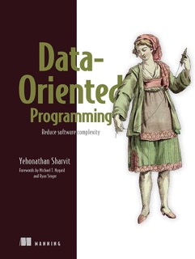

# Data Oriented Programming - Study Repository

This repository contains the source code that I produced whilst studying the Yehonathan Sharvit's book Data Oriented Programming.

For the functiontal library, I'm using [ramda](https://ramdajs.com) instead of [lodash](https://lodash.com)/lodash-fp (used in the book).
